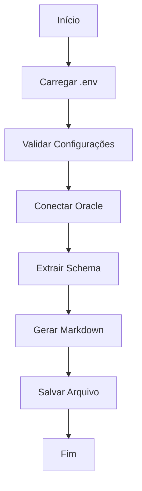

# 📊 Sankhya Schema Extractor

> **Extrator de Dicionário de Dados para ERP Sankhya**

Este projeto extrai automaticamente o dicionário de dados do sistema Sankhya (tabelas TGF, TSI e TCB) de um banco de dados Oracle e gera documentação em formato Markdown para uso com IAs generativas na criação de consultas SQL.

## 🎯 Objetivo

O projeto foi desenvolvido para facilitar a geração de consultas SQL para o ERP Sankhya através de IAs generativas, fornecendo documentação estruturada e completa do schema do banco de dados.

## ✨ Funcionalidades

- 🔗 **Conexão Segura**: Conecta-se ao Oracle Database usando variáveis de ambiente
- 📋 **Extração Automática**: Extrai metadados de tabelas TGF, TSI e TCB
- 📝 **Documentação Estruturada**: Gera arquivo Markdown com dicionário de dados completo
- 🔒 **Segurança**: Suporte a arquivo `.env` para credenciais sensíveis
- 🛡️ **Tratamento de Erros**: Mensagens informativas para diagnóstico de problemas

## 📋 Pré-requisitos

### Software
- **Python 3.7+**
- **Oracle Client** (para conexão com banco Oracle)
- **Acesso ao banco Sankhya** com permissões de leitura nas tabelas:
  - `TDDTAB` (dicionário de tabelas)
  - `TDDCAM` (dicionário de campos)

### Dependências Python
```bash
pip install oracledb
```

## ⚙️ Configuração

### 1. Variáveis de Ambiente

Configure as seguintes variáveis de ambiente:

| Variável | Descrição | Obrigatório | Padrão |
|----------|-----------|-------------|---------|
| `DB_USER` | Usuário do banco Oracle | ✅ | - |
| `DB_HOST` | Endereço do servidor Oracle | ✅ | - |
| `DB_PORT` | Porta do servidor Oracle | ❌ | `1521` |
| `DB_SERVICE` | Nome do serviço Oracle | ❌ | `prodpdb` |
| `DB_PASSWORD` | Senha do usuário | ❌ | Solicita interativamente |

### 2. Métodos de Configuração

#### Opção A: Arquivo `.env` (Recomendado)
Crie um arquivo `.env` na raiz do projeto:

```env
DB_USER=seu_usuario
DB_HOST=servidor.oracle.com
DB_PORT=1521
DB_SERVICE=sankhya_prod
DB_PASSWORD=sua_senha_segura
```

#### Opção B: Variáveis de Sistema
```bash
# Windows
set DB_USER=seu_usuario
set DB_HOST=servidor.oracle.com

# Linux/Mac
export DB_USER=seu_usuario
export DB_HOST=servidor.oracle.com
```

## 🚀 Como Usar

### 1. Instalação
```bash
# Clone o repositório
git clone <url-do-repositorio>
cd sankhya-schema-extractor

# Instale as dependências
pip install -r requirements.txt
```

### 2. Configuração
```bash
# Copie o arquivo de exemplo
cp .env.example .env

# Edite com suas credenciais
nano .env
```

### 3. Execução
```bash
python sankhya_schema.py
```

### 4. Resultado
O script gerará o arquivo `sankhya_schema.md` com o dicionário completo.

## 📁 Estrutura do Projeto

```
sankhya-schema-extractor/
├── sankhya_schema.py      # Script principal
├── sankhya_schema.md      # Dicionário gerado
├── requirements.txt       # Dependências Python
├── .env.example          # Exemplo de configuração
├── .env                  # Configurações (não versionado)
└── README.md            # Esta documentação
```

## 🔧 Arquitetura do Código

### Funções Principais

#### `load_env_file()`
- **Propósito**: Carrega variáveis de ambiente do arquivo `.env`
- **Comportamento**: Suporte a comentários e validação de formato

#### `extract_sankhya_schema(connection)`
- **Propósito**: Extrai e formata o schema do banco
- **Retorna**: String formatada em Markdown
- **Processo**:
  1. Consulta tabelas do dicionário (`TDDTAB`, `TDDCAM`)
  2. Filtra tabelas relevantes (TGF%, TSI%, TCB%)
  3. Formata em tabelas Markdown

### Fluxo de Execução


## 📊 Exemplo de Saída

O arquivo `sankhya_schema.md` gerado contém:

```markdown
# Dicionário de Dados Sankhya

## Tabela: `TGFPRO`

**Descrição:** Produtos

| Coluna | Descrição | Tipo de Dado |
|---|---|---|
| `CODPROD` | Código do Produto | I |
| `DESCRPROD` | Descrição do Produto | S |
| `REFERENCIA` | Referência | S |
```

## 🔒 Segurança

- **Credenciais**: Nunca commite o arquivo `.env` no repositório
- **Conexão**: Use sempre conexões seguras (TLS/SSL) em produção
- **Permissões**: Configure permissões mínimas necessárias no banco


**Desenvolvido com ❤️ para a comunidade Sankhya**

